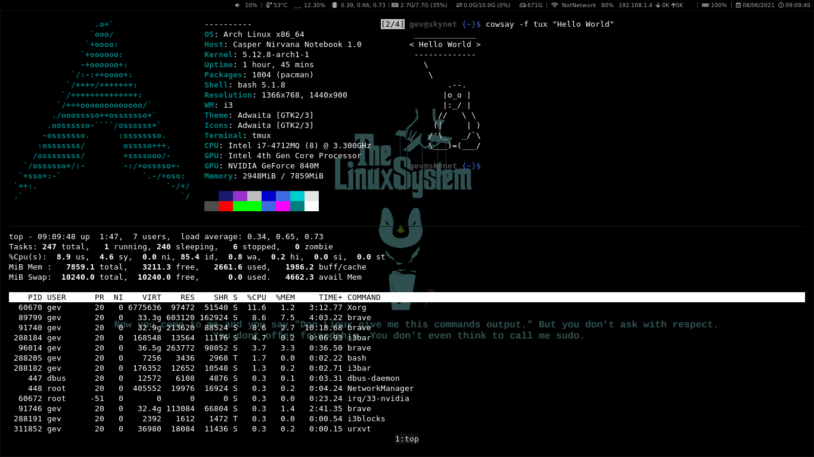
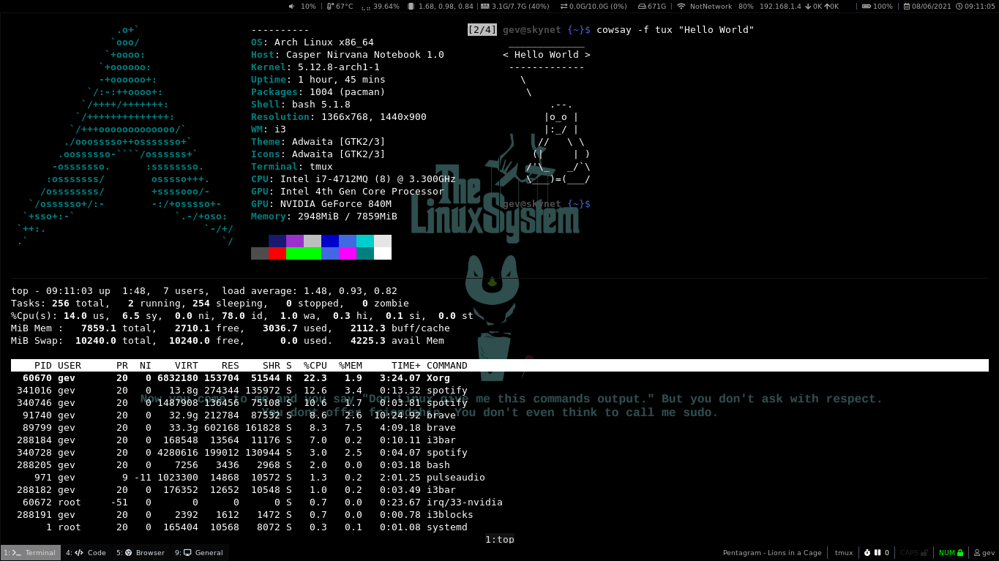

# My Config Files

=======
##### WM: i3-gaps
##### Bar: i3Blocks
##### Terminal: Urxvt + tmux
##### Editor: Vim

##### Vim Plugins:
    NERDTree
    CoC (Conquer of Completion)
    indentLine
    Airline
    Bracey

